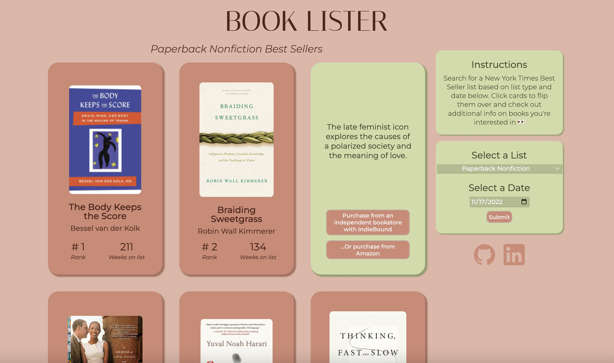
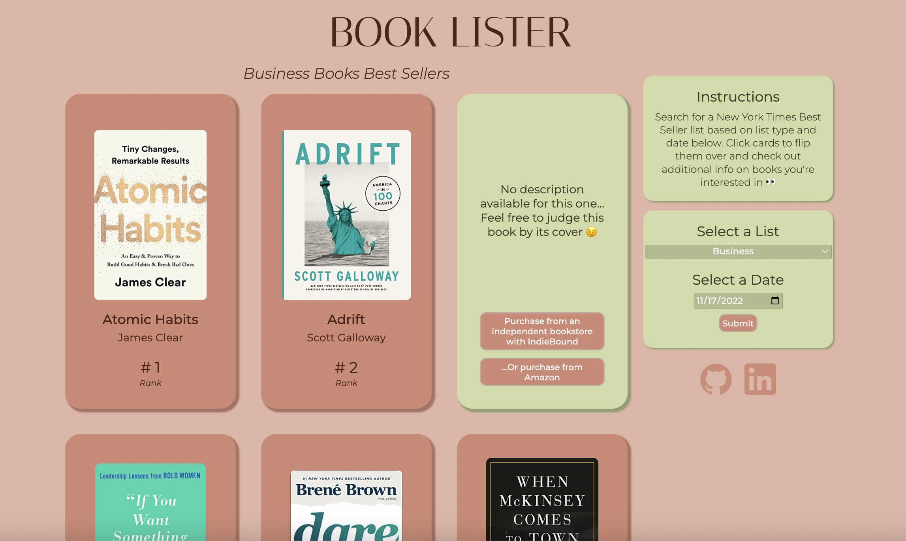

## Book Lister

### **Background** 🏞

***Book Lister*** serves as a data visualization for The New York Times’ best sellers book list using the NYT Books API. Users can filter the books they’re shown by list and date, and each book is depicted as a flippable card with relevant book data.

### **Functionality & MVPs** 🏋🏼‍♀️

In ***Book Lister***, users can:

1. Filter the books they’re shown by list (hardcover fiction, paperback nonfiction, etc.)
2. Filter the books they’re shown by date (since new best seller lists come out weekly/monthly)
3. View the following data on best selling books:
   - _Cover image_
   - _Title_
   - _Author_
   - _Rank on their respective list_
   - _Number of weeks on their list_
   - _Description_
   - _Link to purchase the book from an independent bookstore with Indiebound_
   - _Link to purchase the book from Amazon_

### **Wireframe** 🖼

### **...Vs. Reality** 🖥

_Paper Nonfiction List Example_
  

_Business Books List Example_

Above a 3x5 grid of books (each NYT best seller list includes 15 titles!) are the page’s main heading and a subheading indicating which dynamically updates as the site displays different list types. The site defaults to the NYT’s default list- _Combined Print & E-Book Fiction_.

In the live screenshots, the pink cards reflect a card's/book's default (“up”) position, displaying the relevant cover image, title, author, list rank, and the number of weeks on the list. If the database indicates that a book has been on the list for 0 weeks (either due to faulty data or the book living on a monthly list), its card's styling dynamically updates to not include weeks on list data and centers the book's rank data on the bottom of the card (seen in the Business Books List Example screengrab). The inner HTML for weeks on list data also dynamically changes to be plural or singular if a book has been on a list for more than one week or not.

Also in the live screenshots, the top right cards depict a card's flipped (”down”) position, displaying its description and buttons that will send the user to purchasing links. As shown in the Business Books List Example, if the database is missing the description of a book, a default description will be used instead.

The right side panel consists of a couple of sections including instructions and a form containing a dropdown menu to select a list and a date picker that allows the user to view historical best seller list data.

### **Technologies, Libraries, APIs** 👩🏼‍💻

This project will be implemented with the following technologies:

- Vanilla Javascript, AJAX, HTML, and CSS ✨
- NYT Books API to access/display book data 📚
- Webpack and Babel to bundle and transpile the source JavaScript code 🚀
- npm to manage project dependencies 👀

### **Implementation Timeline** 📆

**Thursday Afternoon**: Complete final proposal and setup project, including getting webpack up and running.

**Friday**: Build a basic HTML skeleton for main and side sections. Ensure capability of rendering results from API calls in browser using AJAX. Flesh out a basic Card/Book class. Build a lightweight backend to hide API keys/allow for CORS proxy if needed.

**Weekend**: Implement display of main book/card grid based on list title, as well as accurate data fields on cards. Implement flipping action for cards.

**Monday**: Implement ability to search historical best seller lists based on user interaction with a calendar or some other form in the side panel.

**Tuesday**: Troubleshooting, refactoring, and CSS Styling

**Wednesday**: Troubleshooting, refactoring, and CSS Styling. If time allows, add a secondary tab to allow users to search for independent bookstores in their area. Finalize presentation/fill out scorecard.

**Thursday Morning**: Deploy to GitHub pages. If time allows, rewrite this proposal as a production README.
