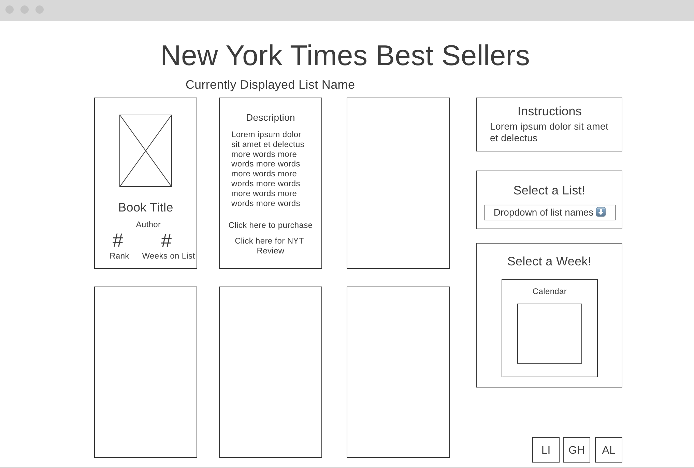

## NYT Books Data Visualization _(...more creative name to come soon)_
 

### **Background** 🏞

This project serves as a data visualization for The New York Times’ best sellers book list using the NYT Books API and the Google Books API. Users can filter the books they’re shown by list and week, and each book is depicted as a flippable card with relevant book data.

 

### **Functionality & MVPs** 🏋🏼‍♀️

In ***NYT Best Sellers Data Visualization***, users will be able to:

1. Filter the books they’re shown by list (hardcover fiction, paperback nonfiction, etc.)
2. Filter the books they’re shown by week (since new best seller lists come out weekly)
3. View the following data on best selling books:
   - _Cover image_
   - _Title_
   - _Author_
   - _Rank on their respective list_
   - _Number of weeks on their list_
   - _Description_
   - _Link to the book’s NYT review_
   - _Link to purchase the book_

In addition, this project will include:

1. User instructions
2. Production README

 

### **Main Wireframe** 🖼

Above a 3x5 grid of books (each NYT best seller list includes 15 titles!) are the page’s main heading and a subheading indicating which list the site is currently displaying. The site defaults to the NYT’s default list- _Combined Print & E-Book Fiction_.

The top left card depicts a card's/book's default (“up”) position, displaying the relevant cover image, title, author, list rank, and the number of weeks on the list. The top middle card depicts card's flipped (”down”) position, displaying its description, a link to the book’s NYT review, and a link to purchase the book.

The right side panel consists of a few sections including instructions, a dropdown menu to select a particular list aside from the default, and a calendar or some other form to select a week from which to display historical best seller data.

Finally, the bottom right corner contains icons with links to my LinkedIn, Github, and AngelList profiles.

 

### **Technologies, Libraries, APIs** 👩🏼‍💻

This project will be implemented with the following technologies:

- Vanilla Javascript, AJAX, HTML, and CSS ✨
- NYT Books API and Google Books API to access/display book data 📚
- Webpack and Babel to bundle and transpile the source JavaScript code 🚀
- npm to manage project dependencies 👀

 

### **Implementation Timeline** 📆

**Thursday Afternoon**: Complete final proposal and setup project, including getting webpack up and running.

**Friday**: Build a basic HTML skeleton for main and side sections. Ensure capability of rendering results from API calls in browser using AJAX. Build a lightweight backend to hide API keys/allow for CORS proxy if needed.

**Weekend**: Implement display of main book/card grid based on list title, as well as accurate data fields on cards. Implement flipping action for cards.

**Monday**: Implement ability to search historical best seller lists based on user interaction with a calendar or some other form in the side panel.

**Tuesday**: Troubleshooting, refactoring, and CSS Styling

**Wednesday**: Troubleshooting, refactoring, and CSS Styling. If time allows, add a secondary tab to allow users to search for independent bookstores in their area. Finalize presentation/fill out scorecard.

**Thursday Morning**: Deploy to GitHub pages. If time allows, rewrite this proposal as a production README.
